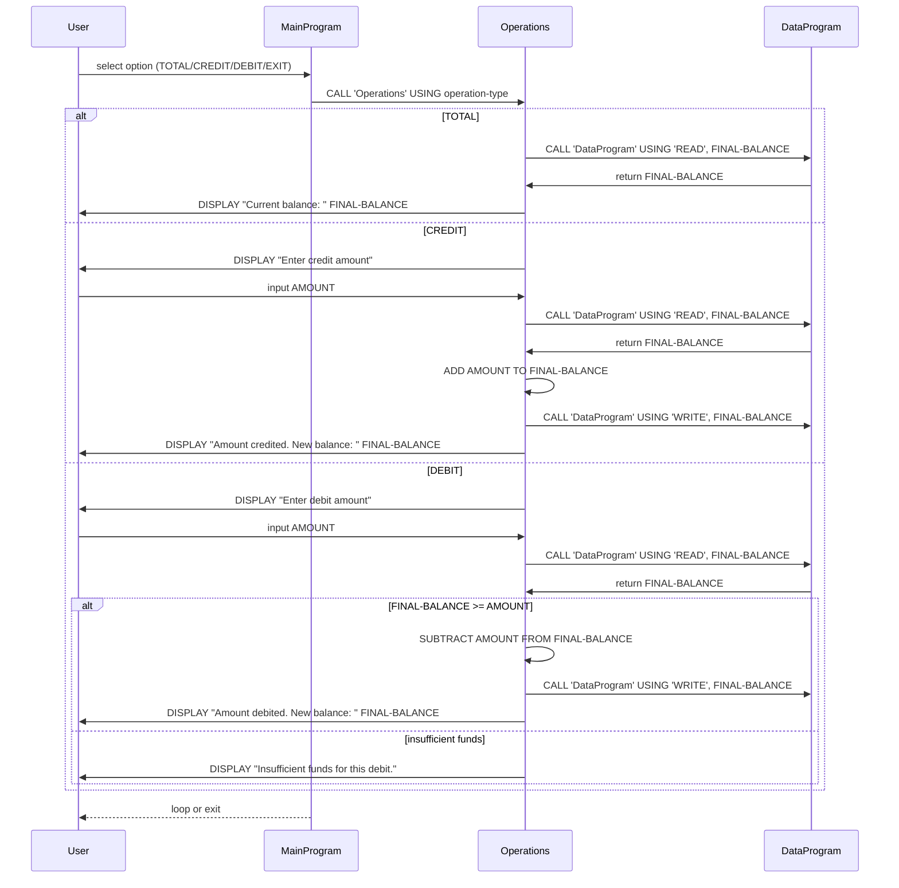

# COBOL Student Account System Documentation

## Overview
This project demonstrates a small COBOL-based account management system designed around a student account use case. It includes:
- `main.cob`: user interaction and menu control
- `operations.cob`: business logic for account operations (view, credit, debit)
- `data.cob`: in-memory data storage/mutator for account balance

## File Purposes

### `src/cobol/main.cob`
- Entry point program (`MainProgram`)
- Displays options for:
  - View Balance
  - Credit Account
  - Debit Account
  - Exit
- Receives user input and calls `Operations` with parameter:
  - `TOTAL` for balance query
  - `CREDIT` for deposit
  - `DEBIT` for withdrawal
- Exits on choice 4 with friendly message

### `src/cobol/operations.cob`
- Program ID: `Operations`
- Accepts operation type from main
- Routes operation to data access layer (`DataProgram`):
  - `TOTAL` -> READ balance and display
  - `CREDIT` -> read balance, add amount, write balance, display new total
  - `DEBIT` -> read balance, check sufficiency, subtract if possible, write balance, display new total
- Handles insufficient funds case with message and aborts withdraw

### `src/cobol/data.cob`
- Program ID: `DataProgram`
- In-memory storage for a single student account balance (`STORAGE-BALANCE` with initial 1000.00)
- Implements pseudo-persistence via working storage and parameter passing
- Supports two operations:
  - `READ`: copies `STORAGE-BALANCE` to output `BALANCE`
  - `WRITE`: updates `STORAGE-BALANCE` from input `BALANCE`

## Key Functions and Modules
- `MainProgram.MAIN-LOGIC`: menu loop, command dispatch, termination flow
- `Operations`: core transaction logic and validation
- `DataProgram`: data access functions and balance state management

## Student Account Business Rules
- Starting balance is `1000.00` (hardcoded)
- Debit is allowed only when `FINAL-BALANCE >= AMOUNT`
- Negative balances are prohibited; insufficient funds show an error message
- Credit and debit are integer-based with two decimals `PIC 9(6)V99`
- All operations update the same in-memory balance rather than persistent file storage
- `TOTAL` operation is read-only and does not modify state

## Notes for Modernization
- Current implementation uses static in-memory balance; consider persistent storage (file/DB) for real student accounts
- No user authentication or account IDs; maintain this as single-account demo context
- Add input validation for non-numeric and negative amounts for production safety

## Sequence Diagram (Mermaid)

